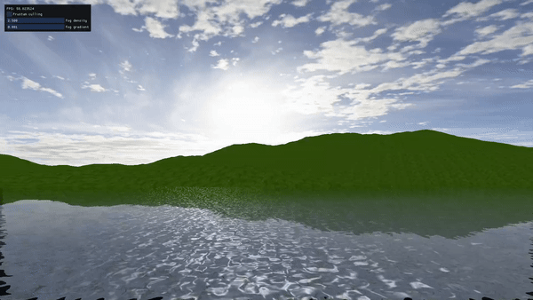

# Vulkan Terrain Renderer


WIP procedural terrain renderer that uses tessellation for dynamic LOD and simplex noise for terrain generation.

# SSR Water (click the image to go to video)

[](https://www.youtube.com/watch?v=PwTlpPUrfv4)

Currently I'm working in a water shader which uses Screen Space Reflection for shading, it also uses a refraction/reflection ratio loosely based on fresnel effect. One thing I would like to improve is to make this shader PBR once I research more on the topic.

# Build

The project uses CMake and have been built both on linux (Ubuntu) and Windows 10.

In order to compile it you'll need Vulkan SDL installed, CMake, and a c++ compiler (msvc++ on windows or g++ on linux tested)

Instructions for Linux:

```
mkdir build &
cd build &
cmake .. &
make
```

For windows, you can open it with Visual Studio as a CMake Project.